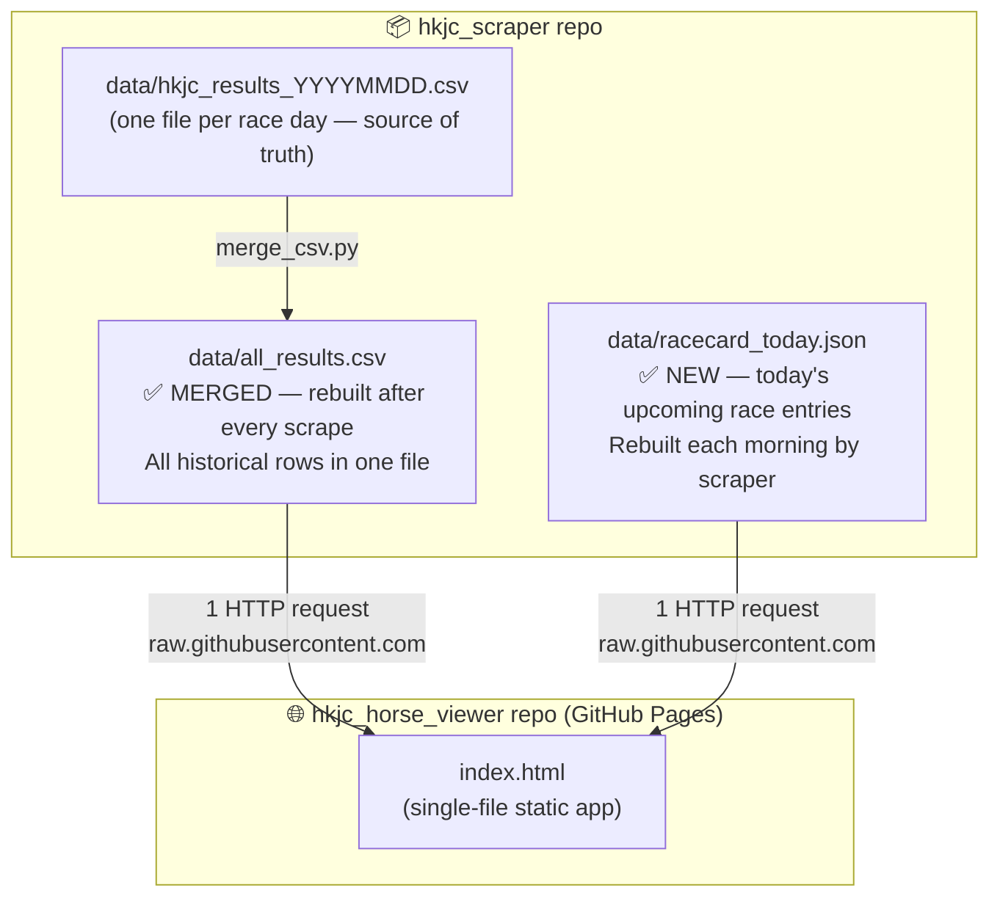
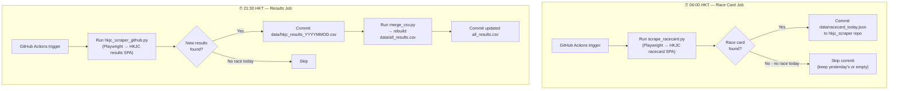
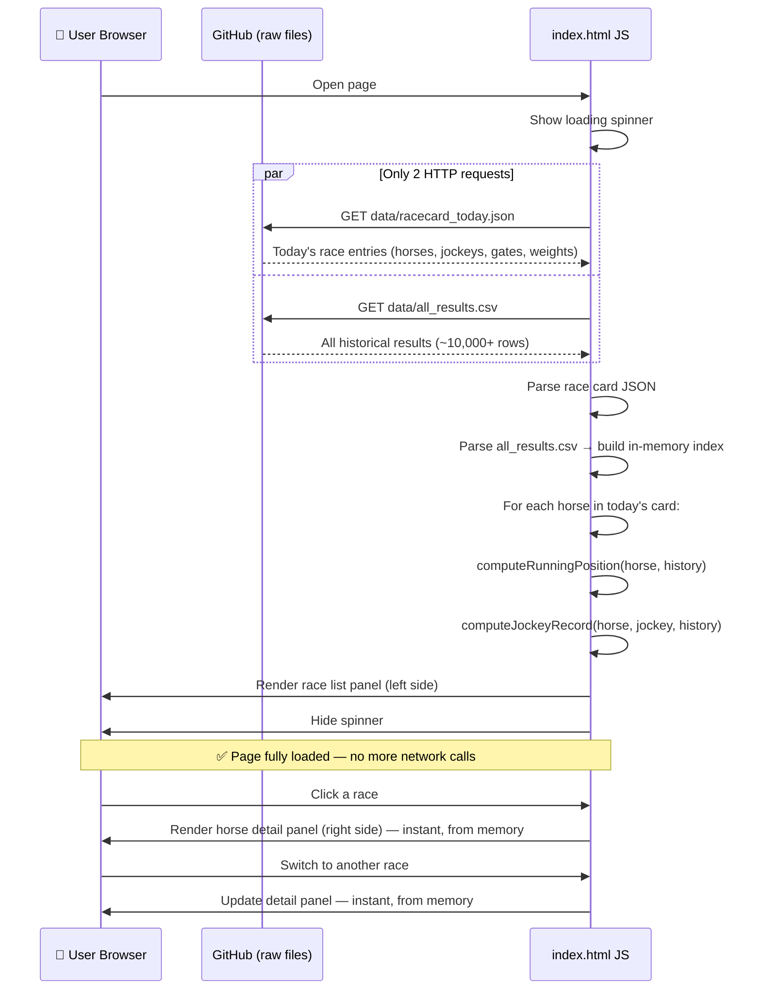
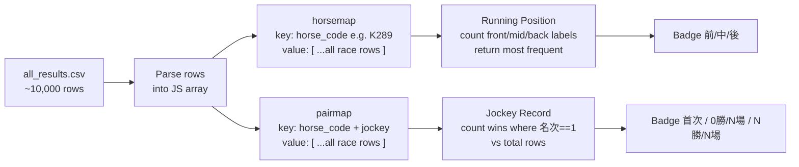

# Data Workflow — HKJC Horse Viewer

---

## Decision 1 — How to Load Today's Race Data

### Options considered

| Option | Description | Problem |
|--------|-------------|---------|
| A — Direct browser fetch | `index.html` fetches from `racing.hkjc.com` at page open | HKJC is a JavaScript SPA; no CORS headers. A plain `fetch()` returns an empty shell. **Not possible** from a static page. |
| B — CORS proxy | Route the fetch through a public proxy service | Unreliable third-party service; proxy may be throttled or shut down. Security risk. |
| **C — GitHub Actions daily schedule** ✅ | A scheduled workflow runs the Playwright scraper once per day, commits the race card JSON to the repo. The viewer reads from `raw.githubusercontent.com`. | None — this is reliable, CORS-free, and reuses the existing scraper infrastructure. |

**Decision: Option C — GitHub Actions daily schedule.**

The scraper already uses Playwright to handle the SPA. We wrap it in a scheduled GitHub Actions workflow. The viewer only ever talks to GitHub (raw file URLs) — no CORS issues.

---

## Decision 2 — Where to Store Historical Data

### Current state
82 individual CSV files in `hkjc_scraper/data/`, ~10,000 rows total.

### Options considered

| Option | Description | Problem |
|--------|-------------|---------|
| A — Fetch each CSV individually | Viewer calls GitHub Contents API, then fetches each file one by one | 82+ HTTP requests on every page load. Slow, wasteful, and GitHub may rate-limit. |
| B — SQLite file in repo | Merge all data into a `.db` file | Cannot be queried directly in the browser without a WASM SQLite library. Adds complexity. |
| **C — Single merged CSV** ✅ | A `merge_csv.py` script rebuilds `data/all_results.csv` after every scrape. Viewer fetches this one file. | File grows over time, but at the current rate (~120 rows/race day) it will stay well under 5 MB for a full season. |

**Decision: Option C — single merged `all_results.csv`.**

One HTTP request, no dependencies, trivially parsed with standard JS. The GitHub Actions workflow rebuilds it after each new race day is scraped.

---

## 1. Storage Architecture



---

## 2. GitHub Actions Pipeline



---

## 3. Page Load Sequence (User Opens index.html)



---

## 4. Data Files Explained

### `data/racecard_today.json` (new file, rebuilt daily)

Contains today's upcoming race entries — scraped each morning **before** races start.

```json
{
  "date": "2026/05/29",
  "venue": "ST",
  "scraped_at": "2026-05-29T22:05:00Z",
  "races": [
    {
      "race_no": 1,
      "distance": "1200米",
      "going": "好地",
      "entries": [
        {
          "horse_no": 1,
          "horse_name": "本能(K289)",
          "jockey": "潘頓",
          "trainer": "容天鵬",
          "weight": 133,
          "gate": 3
        }
      ]
    }
  ]
}
```

### `data/all_results.csv` (new file, rebuilt after each race day)

Same 14-column schema as the individual CSVs — just all rows concatenated with one header line. The header appears once at the top.

```
日期,場次,路程,場地狀況,名次,馬號,馬名,騎師,練馬師,實際負磅,排位體重,檔位,完成時間,賽後馬匹狀況
2025/01/01,1,1200米,好地,1,1,中環精英(J042),黃寶妮,容天鵬,124,1151,5,1:09.98,…
2025/01/01,1,1200米,好地,2,2,…
…
```

---

## 5. Analytics: In-Memory Index Design

After `all_results.csv` is loaded, the JS builds two lookup maps:



---

## 6. Files to Create

| File | Repo | Status | Purpose |
|------|------|--------|---------|
| `scrape_racecard.py` | hkjc_scraper | **New** | Playwright script — scrapes HKJC race card SPA → outputs `racecard_today.json` |
| `merge_csv.py` | hkjc_scraper | **New** | Reads all `hkjc_results_YYYYMMDD.csv` → writes `data/all_results.csv` |
| `.github/workflows/scrape.yml` | hkjc_scraper | **New** | Scheduled Actions: morning card job + evening results job |
| `data/racecard_today.json` | hkjc_scraper | Auto-generated | Today's race entries (overwritten each morning) |
| `data/all_results.csv` | hkjc_scraper | Auto-generated | Merged historical results (appended after each race day) |
| `index.html` | hkjc_horse_viewer | **New** | Production viewer, promoted from `prototype.html` |

